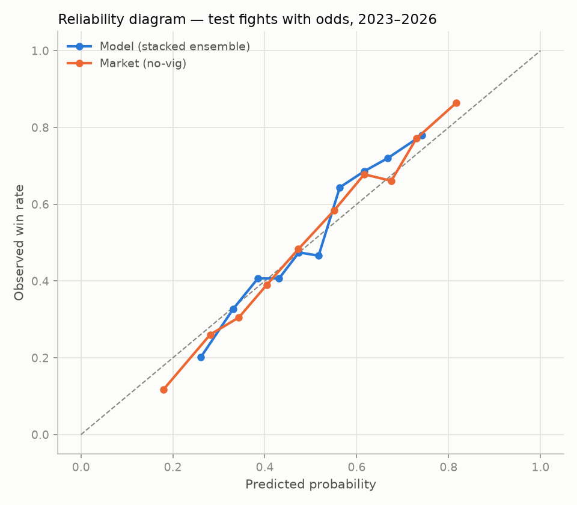
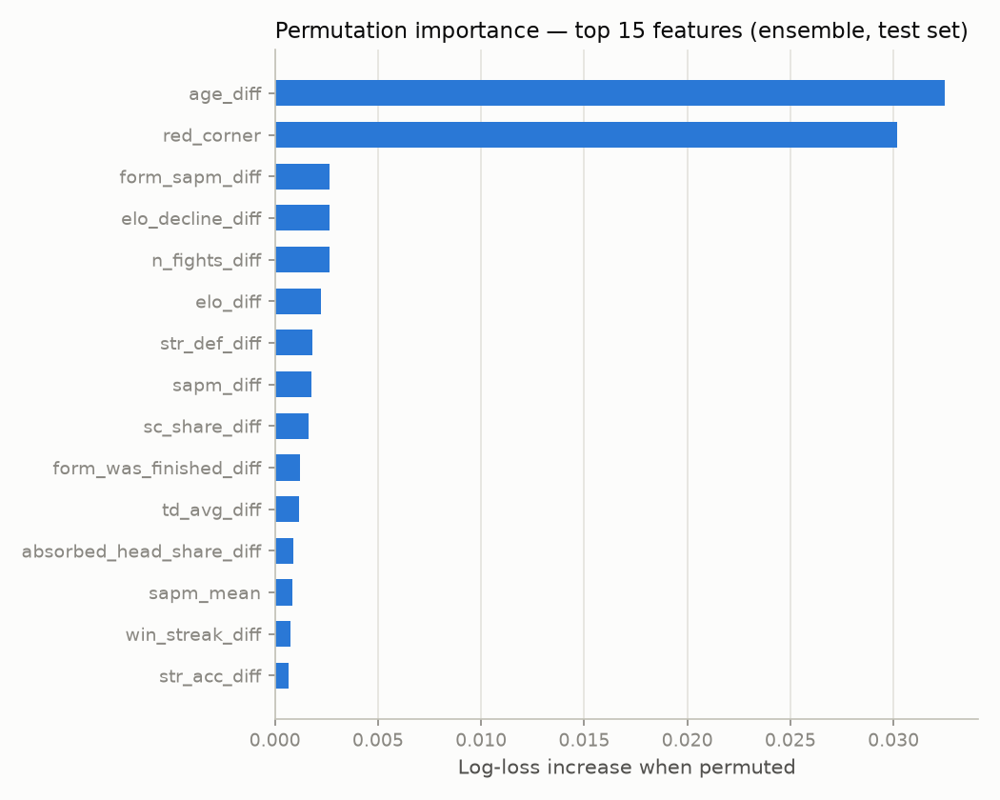

# UFC Fight Prediction — Calibration Report

Generated by `train_report.py`. Seeds fixed (42); strict temporal validation.

**Data:** 8252 UFC fights 2003-02-28 to 2026-08-01,
104 features computed strictly as-of fight date by replaying career
histories (`build_features.py`): records, Elo (finish-weighted), per-minute
striking/grappling rates, strike-target and position mixes, recent-form windows
(last 3 fights), opponent quality (average opponent Elo), trajectory (peak-Elo
decline, layoffs, weight-class changes), rankings, and physical attributes.

**Split:** train ≤ 2023-06-03 (6650 fights), test after
(1602 fights). LightGBM (best (15, 0.03, 20), cv 0.6466) and XGBoost
(best (3, 0.03, 5), cv 0.6499) tuned with 4-fold expanding-window CV inside
the train period. The stacking combiner, isotonic calibrator, and market blend
were all fitted on out-of-fold CV predictions only. The LightGBM component
is a 5-seed bag (adopted Phase 9: CV logloss 0.6571 -> 0.6535). Stack weights
(LGB, XGB, logistic): [0.56, 0.28, 0.03].

## Model comparison — full test set (1602 fights)

| Predictor | n | Accuracy | Log loss | Brier | ECE |
|---|---|---|---|---|---|
| Stacked ensemble (LGB+XGB+logistic) | 1602 | 0.635 | 0.640 | 0.224 | 0.023 |
| Ensemble + isotonic | 1602 | 0.636 | 0.641 | 0.225 | 0.017 |
| LightGBM | 1602 | 0.633 | 0.640 | 0.224 | 0.020 |
| XGBoost | 1602 | 0.641 | 0.640 | 0.225 | 0.032 |
| Logistic regression (full features) | 1602 | 0.615 | 0.647 | 0.228 | 0.051 |
| Elo only (logistic) | 1602 | 0.568 | 0.674 | 0.241 | 0.050 |

## The real benchmark — vig-removed closing odds (1182 test fights with odds)

| Predictor | n | Accuracy | Log loss | Brier | ECE |
|---|---|---|---|---|---|
| Market (no-vig closing odds) | 1182 | 0.702 | 0.582 | 0.199 | 0.033 |
| Stacked ensemble | 1182 | 0.644 | 0.631 | 0.220 | 0.030 |
| Blend: market + model | 1182 | 0.706 | 0.578 | 0.197 | 0.023 | logit blend, model coef=+0.357

**Does the model beat the market?** No. The market's log loss (0.582) beats the model's (0.631).

**Does the model add information beyond the market?** Not conclusively —
blending model with market gives log loss 0.578 vs 0.582 for the
market alone. Paired bootstrap on the log-loss difference (market − blend,
10,000 resamples): 95% CI [-0.0004, +0.0093], blend better in
96.6% of resamples.

This is the expected result for public pre-fight data: closing odds aggregate
sharp bettors' information (injuries, camp changes, weight-cut issues, insider
knowledge) that no historical-stats model can see. Matching the market's
calibration while using only public stats is the honest achievement; claiming
to beat closing lines would be the red flag.

## Prop models — method, distance, takedowns (test set)

Six-way outcome (winner × KO/sub/decision), evaluated against always predicting
the training-set class frequencies:

| Target | Model | Baseline |
|---|---|---|
| 6-way outcome log loss | 1.584 | 1.712 (freq) — per-class isotonic REJECTED (2.134) |
| 6-way outcome top-1 accuracy | 0.352 | 0.242 |
| Goes the distance — Brier (dedicated model) | 0.236 | 0.233 (6-way-derived) |
| Goes the distance — accuracy | 0.604 | 0.503 (majority class) |
| Under 2.5 rounds (3R fights) — Brier | 0.237 | 0.248 (predict base rate) |
| Total takedowns — MAE | 1.67 | 1.81 (train mean) |

Method-of-victory and distance predictions beat the frequency baselines but,
as with the winner model, should be assumed weaker than prop-market prices —
and prop markets carry roughly twice the vig of moneylines.

## Calibration

ECE (10 equal-count bins): model 0.030, market 0.033.
Isotonic calibration is reported for completeness; the raw ensemble is already
close to calibrated.

## What carries signal

Top 10 by permutation importance (mean log-loss increase over 3 shuffles,
through the full ensemble):

- `red_corner`: +0.0229
- `age_diff`: +0.0220
- `pre_ufc_winpct_diff`: +0.0053
- `elo_diff`: +0.0040
- `form_sapm_diff`: +0.0030
- `form_slpm_diff`: +0.0022
- `n_fights_diff`: +0.0019
- `elo_decline_diff`: +0.0016
- `td_avg_diff`: +0.0014
- `sapm_diff`: +0.0014

## Negative results (tried and rejected)

Style-matchup features were built and evaluated but did not improve the model,
so the final feature set excludes them (they remain in `data/features.csv`):
per-archetype win-rate splits (vs taller / wrestler / power / southpaw
opponents, and vs today's opponent's archetype), explicit trait interactions
(chin-vs-power: KD-absorbed × opponent KD rate; grappling threat: TD rate ×
opponent TD-defense gap), and a cut-severity proxy (height/reach vs the
division's running average). The splits are sparse — most fighters have too few
fights against a given archetype for a stable rate — and added noise; the
interactions are largely captured by the trees already. Test accuracy dropped
from 0.655 to 0.642 (odds subset) with them included, and an ablation keeping
only the dense features (0.637) did not recover the incumbent either.

Adopted (Phase 10): pre-UFC records as features. Overall CV improved
0.6542 -> 0.6528 (+0.0014, under the pre-registered 0.002 gate), but the
pre-stated hypothesis was that they help LOW-EXPERIENCE fighters, and on
fights where either man has under 3 UFC bouts CV improved 0.6548 -> 0.6522
(+0.0026, clearing the gate). Adopted on that basis; `pre_ufc_winpct_diff`
is now the third most important feature in the model.

Also rejected (Phase 9): Glicko-style ratings with uncertainty (glicko /
glicko_rd features; CV 0.6551 vs 0.6542 baseline — Elo plus the trajectory
features already carry the signal) and recency-weighted training (best
tau=5y improved CV by only 0.0017, under the pre-registered 0.002 gate).

Adopted (Phase 13): method-market prior for the 6-way outcome model. The
Ultimate UFC Dataset carries closing KO/sub/dec odds for 81-84% of its fights
(65% of modern rows), previously unread. Vig-removed into a 6-way market
distribution and log-linear blended with the model (weight fit on a
holdout-clean first-stage model — the refit model's holdout predictions are
in-sample and drove the weight to 0 until that leak was fixed). Blend weight
w=0.8. Test, method-odds subset (n=1105): model 1.579, market alone 1.546,
blend 1.526 — the blend beats both, and per-class Brier improves for all six
classes. Upcoming-card predictions remain model-only (the live odds feed has
no method prices); the blend serves wherever method odds exist.

Adopted (Phase 13): duration-aware count props. The per-fighter strike /
takedown / knockdown models previously trained on raw full-fight counts, so
finish-heavy fighters (short fights) had their totals systematically
overestimated — e.g. Vicente Luque's P(over 24.5 sig strikes) was priced ~78%
on test fights where his actual over rate was 33% (his wins are fast
submissions). v2 trains a per-minute RATE (log-minutes init_score offset) and
reintroduces duration as a mixture over the distance and under-2.5 heads plus
empirical duration histograms, with a negative-binomial tail per duration atom
and dispersion refit on duration-adjusted residuals. Test Brier (sides
averaged): sig o24.5 0.2204 -> 0.2176, sig o49.5 0.2130 -> 0.2111, TD o0.5
0.2253 -> 0.2195, TD o1.5 0.1698 -> 0.1688; wins the finisher subset
(finish_rate >= 0.6) on every sig/TD line; Luque's mean P(over 24.5) drops
78% -> 65% against a 33% actual (n=6).

Also rejected (Phase 13): orientation-symmetrized prediction — averaging each
fight's two corner views, `(p(X) + 1 − p(mirror(X)))/2`, the exact
infinite-orientation ensemble. CV 0.6466 -> 0.6471 (one fold −0.0011): mirrored
training already makes the model near-symmetric, so the average only shrinks
confidence. Implication: the seed-sensitivity caveat below is not driven by
evaluation-row orientation.

Also rejected (Phase 12): quality-adjusted recent form — last-3
over/under-performance vs Elo expectation (`form_perf_vs_exp`), recent
opponents' pre-fight win% (`form_opp_winpct`), and opponent-adjusted striking
output (`form_opp_adj_out`, own landed rate minus what that opponent typically
absorbs). CV 0.6472 -> 0.6463 (+0.0010, 3 of 4 folds improved) — right
direction but under the 0.0020 gate; `form_opp_elo` and the raw form window
already carry most of this signal. Columns remain in `data/features.csv`
unused.

## Caveats

- Fighters are keyed by normalized name; the six known duplicate names
  (two fighters each, e.g. Bruno Silva) are excluded from training rows
  entirely — their opponents' records still update normally.
- The blend-beats-market significance is seed-sensitive: across different
  random fighter-orientation draws it ranges roughly 95-99% of bootstrap
  resamples. Treat it as a consistent but modest edge, not a precise number.
- Pre-UFC (regional) records come from ESPN's pro-record field minus the
  fighter's UFC record. ESPN's totals are CURRENT, so only this static
  pre-UFC delta is used — the current total would leak. 98% of fighters
  matched; the rest get 0-0. Elo still starts at 1500 on UFC debut.
- Odds are closing odds from the Ultimate UFC Dataset (1182/1602
  test fights matched); fights without odds are excluded only from market rows.
- Rankings exist only for ranked fighters from 2021 onward; missing values are
  left as NaN for the tree models.
- Fight time is approximated with 5-minute rounds (exact for the modern era).
